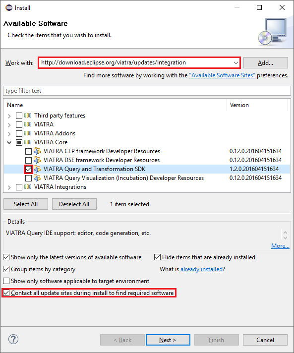
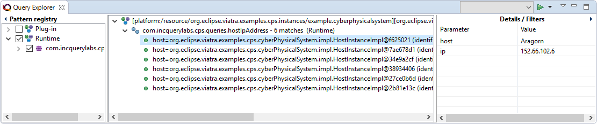

= Viatra Query (Pattern Language)
ifdef::env-github,env-browser[:outfilesuffix: .adoc]
ifndef::rootdir[:rootdir: ./]
ifndef::source-highlighter[:source-highlighter: coderay]
:imagesdir: {rootdir}

Home page: https://www.eclipse.org/viatra/

== Install Viatra Query

Navigate to the homesite of VIATRA and search for update sites at the download page: https://www.eclipse.org/viatra/downloads.php

Copy the URL of _Release builds_ update site: http://download.eclipse.org/viatra/updates/release

Before 28 April 2016 use the milestone update site: http://download.eclipse.org/viatra/updates/milestone

Switch back to your Eclipse instance and select the _Help/Install New Software\..._

.Select *Help/Install New Software\...*
image::screenshots/install.png[Select _Help/Install New Software..._]

Paste the copied URL to the _Work with_ field, than press _Enter_. When the view is updated, select the _Viatra Query SDK_. Tick the _Contact all update sites during install\..._ field. Press _Next_, then _Next_ and finally _Finish_.
After the install process, you should restart Eclipse.

.Install window


For a faster installation, advanced users can untick out the _Contact all update sites during install\..._ field, but they have to install _Xtend_ and _Xtext_ technologies manually.

== Setup the Laboratory

. Install `cps.domain` feature from dropins folder
. Create a new Viatra Query project in the host Eclipse and name it to `com.incquerylabs.cps.queries`.
. Add `org.eclipse.viatra.examples.cps.model` to the Plug-in dependencies
. Create a new query definition in a package named `com.incquerylabs.cps.queries` and a file named `queries.vql`. In the wizard create an empty query. Fill the first query:
+
[[app-listing]]
[source,java]
.queries.vql
----
package com.incquerylabs.cps.queries

import "http://org.eclipse.viatra/model/cps"

pattern hostIpAddress(host: HostInstance, ip) {
    HostInstance.nodeIp(host,ip);
}
----
. Create and launch an eclipse application with default configuration
. In the runtime eclipse, import instances project ```models\org.eclipse.viatra.examples.cps.instances```
. Load the query and the instance model to the **Query Explorer**.

== Query Explorer

*Query Explorer* is the primary debug tool for debugging VIATRA Query patterns runtime. To open the view: _Window/Show View/Others/VIATRA/Query Explorer_ or you can simply press the kbd:[CTRL+3] shortcut and start to type the name of the view. On the left side of the view, there will be patterns inherited from  the host eclipse. The middle part will show you the matches of the patterns. To achive this, we have to load a model into the view:

. Open our example instance model (/org.eclipse.viatra.examples.cps.instances/example.cyberphysicalsystem)
. Make sure "ReteEngine" is selected in the Query Explorer (next to the green arrow button)
. then press the green arrow button on the view.
. Open the query specification (vql file)
. then press the green arrow button again

.Query Explorer


== Pattern Language

. Structure your source code to blocks like this:
+
[[app-listing]]
[source,java]
----
//-------------------------------
// Support
//-------------------------------

//-------------------------------
// Validate
//-------------------------------
----
+
Every pattern goes to one of those categories. The `hostIpAddress` goes to Support.
+
As you can see, every pattern have a unique name and several parameters. Inside the body of the patterns, there different constraints. Our first example describes a feature constraint. It states that `entity` variable is of eClass `Entity` and its `name` attribute is the value of `name` variable.

. Create a query to the *Validate* that checks if the ip address of a `HostInstance` is only an empty string:
+
[[app-listing]]
[source,java]
----
pattern emptyIpAddress(host: HostInstance) {
    HostInstance.nodeIp(host, "");
}
----
+
This pattern shows, that the parameters can be typed immediately in the parameters list.

. Create a query to the *Validate* that checks if two hosts has the same ip:
+
[[app-listing]]
[source,java]
----
pattern sameIpAddress(host1, hist2, commonIp) {
    HostInstance.nodeIp(host1, commonIp);
    HostInstance.nodeIp(host2, commonIp);
    host1!=host2;
}
----
+
This pattern shows the `!=` (_not equal_) operator to select two different entites from the instance model. (Use the `==` operator to equality)

. Create a query to the *Validate* that checks if the ip address contains only numbers and dots:
+
[[app-listing]]
[source,java]
----
pattern ipFormatInvalid(host) {
    HostInstance.nodeIp(host,ip);
    check (
        !name.matches("^[\\d\\.]+")
    );
}
----
+
This pattern shows the `check` block where you can write a wide range of _Xbase_ expressions (similar to Java). In this case, we define a regular expression.

. Create a query to the *Derived* that gets the other endign of a relation ending:
+
[[app-listing]]
[source,java]
----
pattern connectedTo(state: State, other: State){
    State.outgoingTransitions(state, transition);
    Transition.targetState(transition, other);
} or {
    State.outgoingTransitions(other, transition);
    Transition.targetState(transition, state);
}
----
+
This pattern shows how to connect independent bodies in a pattern. To do this, we use the `or` keyword that states the pattern has a match if the first _or_ the second _or_ the third _or_ etc body has a match.

. Create a query to the *Support* that summarizes this three validation condition:
+
[[app-listing]]
[source,java]
----
pattern badHost(host, ip) {
    find sameIpAddress(host, _other, ip);
} or {
    HostInstance.nodeIp(host,ip);
    find emptyIpAddress(host);
} or {
    HostInstance.nodeIp(host,ip);
    find ipFormatInvalid(host);
}
----
+
This pattern shows how to reuse previously defined patterns as sub patterns. To do this, we use the `find` keyword then write the id of the sub pattern and finally add the variables. (Variables starting with `___` define _don't care_ variables, hence you cannot use them in other lines of the pattern)

. Create a query to the *Support* that matches to the valid hosts:
+
[[app-listing]]
[source,java]
----
pattern goodEntity(host, ip) {
    HostInstance.nodeIp(host,ip);
   neg find badHost(host,_);
}
----
+
This pattern shows `neg find` expression to express negation. Those actual parameters of the negative pattern call that are not used elsewhere in the calling body will be quantified; this means that the calling pattern only matches if no substitution of these calling variables could be found.

. Create a query to the *Support* that counts the number of attributes of an entity:  
+
[[app-listing]]
[source,java]
----
pattern applications(host, app) {
    HostInstance.applications(host, app);
}

pattern countApplications(host : HostInstance, M) {
    M == count find applications(host, _);
}
----
+
This pattern shows `count find` expression that aggregates multiple matches of a called pattern into a single value.

== Validation

VIATRA provides facilities to create validation rules based on the pattern language of the framework. These rules can be evaluated on various EMF instance models and upon violations of constraints, markers are automatically created in the Eclipse Problems View.

The *@Constraint* annotation can be used to mark a pattern as a validation rule. If the framework finds at least one pattern with such annotation.

Annotation parameters:

* _key:_ The list of paremeters which determine which objects the constraint violation needs to be attached to.
* _message:_ The message to display when the constraint violation is found. The message may refer the parameter variables between $ symbols, or their EMF features, such as in $Param1.name$.
* _severity:_ "warning" or "error"
* _targetEditorId:_ An Eclipse editor ID where the validation framework should register itself to the context menu. Use "*" as a wildcard if the constraint should be used always when validation is started.

To find a specific editor id, we can use the _Plug-in Selection Spy_ tool with a kbd:[Shift+Alt+F1] shortcut.

For example:

[[app-listing]]
[source,java]
----
@Constraint(targetEditorId = "org.eclipse.viatra.examples.cps.cyberPhysicalSystem.presentation.CyberPhysicalSystemEditorID",
            severity = "error",
            message = "The ip address is not unique",
            key = {"host1"})
pattern sameIpAddress(host1: HostInstance, host2: HostInstance, commonIp) {
    HostInstance.nodeIp(host1, commonIp);
    HostInstance.nodeIp(host2, commonIp);
    host1!=host2;
}
----

== Advanced Queries

. Create *Support* pattern:
+
[[app-listing]]
[source,java]
----
private pattern directReachable(state: State, other: State){
    State.outgoingTransitions(state, transition);
    Transition.targetState(transition, other);
}
----

. Create a pattern that determines the transitive closure of reachable states:
+
[[app-listing]]
[source,java]
----
private pattern reachable(state: State, other: State){
    find directReachable+(state, other);
}

pattern reachableState(sm :StateMachine, state: State){
    StateMachine.initial(sm, state);
} or {
    StateMachine.initial(sm, initial);
    StateMachine.states(sm, state);
    find reachable(initial, state);
}
----

== References

* Pattern Language: https://wiki.eclipse.org/VIATRA/Query/UserDocumentation/QueryLanguage
* Validation Framework: https://wiki.eclipse.org/VIATRA/Addons/UserDocumentation/Validation
* Query Based Features: https://wiki.eclipse.org/VIATRA/Addons/UserDocumentation/Query_Based_Features
